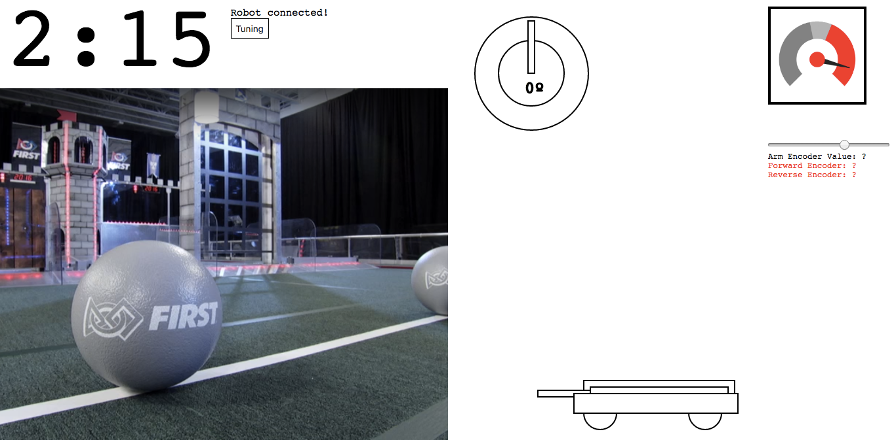

# [FRC Dashboard](https://frcdashboard.github.io)

FRC Dashboard is a fully customizable web-based dashboard for [FIRST Robotics Competition (FRC)](http://firstinspires.org/robotics/frc).

__Contributions are VERY welcome! Please feel free to open a pull request or issue with improvements or a new feature.__

* Completely legal for competition as it works alongside standard DriverStation
* Web browser interface provides richer control interface for secondary robot operator
  * Works with or without touchscreen
* Lots of code commenting to help you easily understand code and add your robot's functions
* Inbuilt camera streaming system, SVG gyroscope, encoder control, and example buttons
* Lots of addons to easily create new dashboard widgets for your own use!

## Training
FRC Dashboard is full of comments and is designed to be easy to understand. However, if you need some help, check out [the official training repository.](https://github.com/FRCDashboard/training).

## Setting up

* For the camera to work, you must change the source in `index.html` to the IP of your live camera feed. This may take some tweaking depending on how your camera stream works. We use and recommend [MJPG Streamer](https://github.com/jacksonliam/mjpg-streamer).
* It is recommended that you close the top panel of the FRC DriverStation to make room for a sized-down Chrome window.

## Running the code

### Dependencies

Python 3 must be installed!

Make sure you have pynetworktables2 installed:

    pip3 install pynetworktables2js

(If you don't have administrator privileges, put `--user` at the end of that command.)

### Start the dashboard server

Run this command:

    python3 dashboardServer.py

### Open dashboard

Open Chrome and go to:

    http://localhost:8888

If you're on Windows, you can open `launch.bat`, which will start the server and open Chrome.

## Addons

There are several prebuilt addons for FRC Dashboard:
* [MultiCamera](https://github.com/FRCDashboard/addon-MultiCamera) - Toggle between multiple camera views, great if your robot has multiple cameras.
* [Tuning](https://github.com/FRCDashboard/addon-Tuning) - Easily modify NetworkTables variables directly. _Included by default._
* [Gyro](https://github.com/FRCDashboard/addon-Gyro) - Gyroscope widget to help orient your robot. _Included by default._
* [AutoSelection](https://github.com/FRCDashboard/addon-AutoSelection) - Simple autonomous selection box. _Included by default._
* [Encoder Slider](https://github.com/FRCDashboard/addon-EncoderSlider) - Slider to change encoder value. Can be easily repurposed to modify any NetworkTables value. _Included by default._
* More coming soon!

_A full list of addons can be found on the [FRC Dashboard website](https://frcdashboard.github.io)._

## Authors

This library is maintained by [Erik Boesen](https://github.com/ErikBoesen).

### Other authors

[FRC Team 1418 Vae Victis](https://github.com/frc1418) used earlier versions of this code in 2015 and 2016.

* [Leon Tan](https://github.com/lleontan) led the original 1418 UI team and coded the first iteration of the UI and pynetworktables2js
* [Dustin Spicuzza](https://github.com/virtuald), 1418 mentor and head of the [RobotPy](https://github.com/robotpy) project.

## License

This software is licensed under the `Apache 2.0` license. Basically, you can do whatever you want, as long as you give credit to the [original source](https://github.com/FRCDashboard/FRCDashboard), and keep the license with it. More information in `LICENSE`.